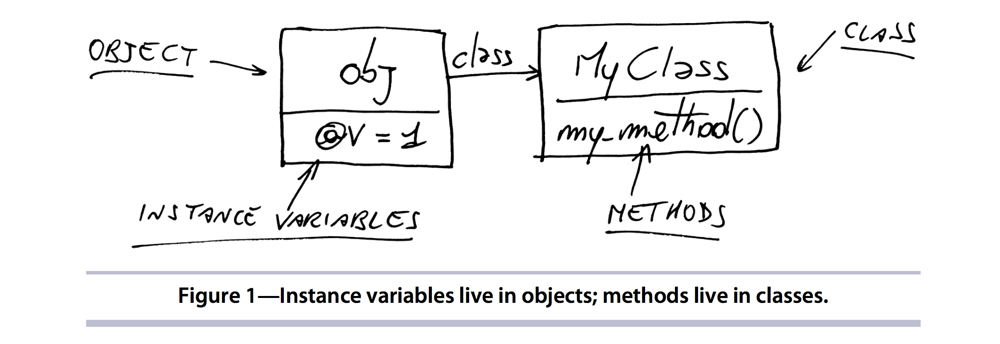
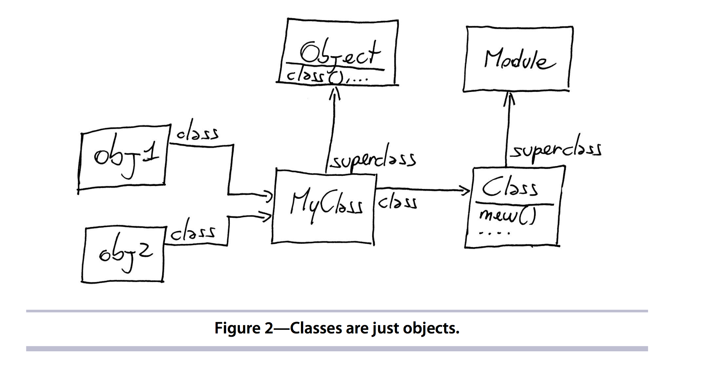

# The Object Model

## `class`
## Problem with Open Classes
## What's an object?
## Classes
## Modules
## Classes as Objects
## Constants
## Structure like a File System
## Objects and Classes Wrap-Up

# `class`

* Open Classes
* Editing Standard Objects

# Open Classes

* `class` as in something like `class Foo` is more like a scope method since:
  * it instantiates `Foo` if it doesn't exist and opens `Foo` otherwise

~~~
class Foo
  def one_method
    puts 'one'
  end
end

class Foo
  def two_method
    puts 'two'
  end
end

foo-instance = Foo.new

foo-instance.one_method # => 'one'
foo-instance.two_method # => 'two'

~~~

# Editing Standard Library Objects

* classes can also be changed on the fly

~~~
class String
  def word_characters
    gsub(/[^\w]+/, '')
  end
end

"asdf1234##".word_characters # => 'asdf1234'
~~~

# Problem with Open Classes

* Do not overwrite existing methods since you might end up with unintended side effects
* known as "monkey patching"
* ex: overwriting `Array#replace`

~~~
class Array
  def replace(...)
  end
end
~~~

# What's an object?

`obj = MyObject.new`

* instance `obj` contain instance variables `@variable`, and ref to class
  * variables not connected to Class
* methods
  * a list can be provided through `MyClass#methods`
  * stored in the class

# Classes

* classes are also objects of `Class`!
  * allows for `Class.new` call
  * Class.instance_methods(false) => [:allocate, :new, :superclass]

# Modules

* very similar to class but with out inheritance
* all classes are modules since they are instances of `Module`
* Picking between `Class` and `Module` is mainly for clarity

# Classes as Objects

* whiteboard the relationships between
  * class MyClass; end
  * obj1 = MyClass.new
  * obj2 = MyClass.new
  * Class
  * Module
  * Object

# Classes as Objects (diagram)

# Constants

* start with a capital letter
* can still be changed

# Structure like a File System

* Classes and Modules are like directories
* constants are like files

~~~
module M
  class C
    X = 'a constant'
  end
  C::X # => "a constant"
end
M::C::X # => "a constant"
~~~

* `Module#constants` returns constants in that scope, like `ls`
* `Module#nesting` returns path's
* Namespacing is creating a Module to contain constants

# Objects and Classes Wrap-Up
